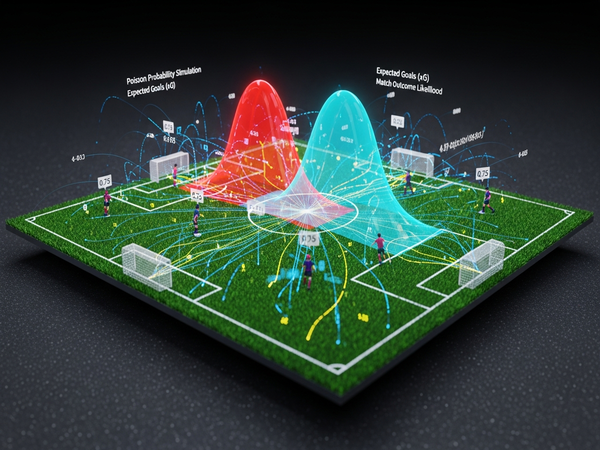

# who-will-win 足球比赛预测

<p align="center">
  
</p>

**给 Claude Code 及兼容 AI agent 使用的足球比赛预测 Skill。立身之本只有一条：绝不瞎说。**

**中文说明** | [English](README.en.md)

给它一场比赛——它会对两队发起一次大规模调研（逐球员可用性排查、战术对位、
往绩深读、教练风格画像），把证据压缩成校准过的预期进球数，再用闭式
Dixon-Coles 引擎给出所有玩法的概率：胜平负、亚洲让球盘（含四分之一球五态
结算）、中国竞彩让球胜平负、以及具体比分。给它一张赔率截图，它会算出期望
收益最大的下注方案。给它多场比赛，它会构建串关——并且把拿不准的场次直接
剔除。

整条管线里，LLM 只做一件事：在有界、有据的规则内估计预期进球。所有涉及钱
的数学——比分矩阵、四分之一球结算、去水、期望值、凯利、串关枚举——全部交给
零依赖的纯 Python 脚本，一个随机数都不掷。

## 预测管线 (Prediction Pipeline)

四个阶段，从原始情报到下注注单，环环有闸门、步步留证据。

---

### STAGE 01 — 大规模情报侦察 (Large-Scale Intelligence Scouting)

<p align="center">
  
</p>

*调研深度就是产品。海量噪音里，只有第一手证据能变成数理参数。一场比赛动辄
数十次定向搜索，由多路并行子代理同时推进。*

- **球队级并行开火 (Phase 1，8–10 路并发)。** 收到比赛的一瞬间，Orchestrator
  一次性并行射出 8–10 条队级搜索：赛事锁定（日期/场地/首回合还是次回合）、
  联赛榜单与主客场分项、双方伤停、预测首发、战术前瞻、市场赔率、以及中文源
  的亚盘伤停情报。赛事一旦搞错，后面再精密也救不回来——所以第一步永远是把
  比赛本身钉死。
- **逐球员横扫：每队一个子代理 (Phase 2)。** 这是护城河。对**每一名**预期首发
  和关键替补——每队 8–15 人——派出的子代理逐人独立搜索：是否仍在队、有无伤
  病或带伤、停赛、国家队征调的体能消耗、近期评分与进球。每个子代理把结果收敛
  成一张结构化可用性表（球员 / 角色 / 是否可用 / 状态 / 来源+日期）。一篇旧稿
  一句"全主力"，会在一次球员级搜索面前当场破功。
- **往绩深读 + 补漏 (Phase 3–4)。** 逐场精读双方近 5 场比赛报道——不是看比分
  串，而是看进球怎么来的、表现与结果是否背离（碾压却输球？偷袭得手？）；交锋
  史只看过程里的克制模式，不看比分本身；杯赛淘汰赛还要查球队与教练在同一阶段
  的历史战绩模式；再对教练做风格专项检索。最后补齐 xG、Elo、休息天数差、天气、
  裁判牌风等边缘扰动项。
- **三级来源分级 + 反幻觉纪律。** 每条来源强制分级：**Tier 1 事实级**（官方
  公告、发布会原话、首发名单、统计数据库）、**Tier 2 报道级**（跟队记者、训练
  场观察、随队名单）、**Tier 3 情绪级**（预测文章、专家推介、论坛贴吧）。只有
  Tier 1/2 第一手来源才能进参数；预测文章一律降级为舆情信号，零权重。人员信息
  禁止凭记忆——每一条伤停/转会/停赛都必须是本会话搜到、且带日期；超过 14 天的
  旧闻强制重新核验。

---

### STAGE 02 — 证据量化与 Dixon-Coles 引擎 (Quantification & Dixon-Coles Engine)

<p align="center">
  
</p>

*把厚厚的证据链压缩成两个数：主客队的预期进球 $\lambda_H$、$\lambda_A$。可复现、
可审计、可测试。*

- **八步有界配方 → λ。** 拆分主客场 xG/xGA → 近因混合
  $0.7\times\text{赛季} + 0.3\times\text{近6场}$ → 带联赛先验的乘法强度模型
  $\lambda_H^{\text{raw}} = \mu_H \cdot Att_H \cdot Def_A$ → 分档锚定表交叉检验
  → 逐项修正（人员、轮换、战术、休息、动机），**每项修正有独立上限，累计乘积
  硬夹在 $[0.70, 1.30]$**。λ 本身还有硬边界 $(0.1, 6.0]$ 与警告区 $[0.5, 3.5]$，
  越界即报警重推。每一步都必须能引用当次会话找到的证据，宁可跳过也不瞎编。
- **先估后锚。** 铁律：预备 λ 必须在**看任何赔率之前**写下来。这一步顺序是纪律
  的核心——它既防止把市场的数字洗一遍冒充成自己的分析，也逼你正视一个可能比你
  更早知道首发泄露的市场。
- **闭式 Dixon-Coles 解析引擎。** 纯 Python、零第三方依赖。它不做任何蒙特卡洛
  模拟——而是**闭式解析**地算出整张比分概率矩阵：Dixon-Coles 的 $\tau$ 低比分
  修正项配合 $\rho$ 参数（默认 $-0.10$）纠正标准泊松对 0-0、1-0 这类小比分的
  系统性低估；矩阵尾部质量低于 $10^{-6}$ 时自动扩栏并重新归一化，冷门大比分也
  不会悄悄丢概率。确定性、可复现、由 64 个测试背书。
- **风格重加权（1X2 严格不变）。** 控场型（领先就收）与屠刀型（刷净胜球到最后
  一分钟）的教练画像会改变比分**分布形状**——在同一支球队的获胜区内，把大胜
  质量与小胜质量互相搬移——但胜/平/负三向概率分毫不动。这是测试断言的不变量，
  不是玄学。
- **一次输出全盘口。** 胜平负及公平赔率、亚盘全线阶梯（每条四分之一球线拆成
  全赢/半赢/走盘/半输/全输五态结算分布，主客两侧独立）、竞彩让球胜平负、以及
  0-0 起的完整精确比分矩阵与最可能比分。

---

### STAGE 03 — 去水与正 EV 闸门 (De-Vig & Positive-EV Gate)

<p align="center">
  
</p>

*模型给出真实概率，市场给出含水赔率。这一层负责把水挤干，再逐项对比找边际。*

- **四制式赔率识别换算。** 自动识别欧洲盘、香港盘、马来盘、印尼盘并统一换算为
  十进制赔率。落在 1.0–1.25 这种十进制与港盘水位歧义区间的输入，脚本**硬报错**
  要求显式指定格式，绝不猜——猜错一次，下游每个数字都被悄悄污染。
- **双法去水：比例法 + 幂法。** 同时用比例法和幂法两种口径剥离庄家抽水；决策
  一律采用**幂法**——它二分逼近求解衰减指数 $\gamma$（解 $\sum_i(1/d_i)^\gamma=1$），
  对冷门的压缩强于对热门，正好修正大众追捧热门造成的"热门-冷门偏差"，还原出
  更公允的市场隐含概率。
- **全盘口 EV 扫描。** 把模型概率与去水市场概率按
  $p_{\text{blend}} = 0.65\,p_{\text{model}} + 0.35\,p_{\text{market}}$ 融合后，
  对每一个盘口选项算期望值 $\mathbb{E} = p\cdot d - 1$；四分之一球注单则在五态
  结算分布上按对应权重算 EV。谁 EV 最高就选谁——精确比分在数字支持时也是合法
  的一等下注选项。
- **分歧纪律 + 长赔防护。** 模型与去水市场在任一结果上偏离超过 10 个百分点，
  强制重审：是漏了球队新闻，还是 xG 过时，还是盘口被首发泄露带动了？幸存下来的
  分歧，必须在报告里写清"市场为什么错"的论点，否则把估计拉回市场。赔率高于
  4.0 的长赔选项，EV 阈值自动翻倍，专治小概率高赔的诱惑。
- **"NO VALUE — 观望"是一等公民。** 当模型与市场高度一致、找不出正 EV 选项时，
  第一结论就是"无正 EV 选项，建议观望"。不交学费也是一种赢。

---

### STAGE 04 — 分数凯利与串关组合 (Fractional Kelly & Parlay Portfolio)

<p align="center">
  
</p>

*找到边际只是一半，另一半是下多少、怎么串。*

- **分数凯利仓位。** 用凯利公式 $f^* = \dfrac{bp - q}{b}$ 算全额注比，再乘保守
  的分数系数（默认 1/4 凯利）缩小仓位；每注设单注上限，多注同时命中时按预算
  归一化，组合总仓位封顶在本金的 6%。
- **五态凯利（四分之一球）。** 亚盘四分之一球注单没有简单的输赢二态，脚本在
  全赢/半赢/走盘/半输/全输五种结算状态构成的收益分布上，用**黄金分割法
  （Golden-Section Search）一维搜索**——100 次区间收缩迭代——求解使对数增长
  $\mathbb{E}[\log(1+f\cdot r)]$ 最大的凯利注比，不是套用二态公式糊弄。
- **串关腿资格闸门。** 组串前每条腿过三道闸：置信 C 的场次剔除、混合概率
  低于 0.55 剔除、单腿 EV ≤ 0 剔除，每条剔除都列明理由。原则很硬：拿不准的
  场次不降权、直接踢出去。
- **N串1 到 N串M 全枚举。** 对幸存的腿枚举所有组合（如 4串11 即 4 条腿里所有
  2–4 串的 11 个组合），逐一算总赔率、命中率、EV 与凯利注比，给出最优收益曲线。
  玩法范围锁死在胜平负、亚盘、竞彩让球、精确比分。

---

## 差异化在哪

- **调研深度就是产品。** 每场比赛数十次定向搜索——包括对两队每一名预期首发
  逐人搜索状态（分派给并行子代理执行），并且逐场阅读两队近五场比赛报道，
  而不是只看比分串。
- **只认第一手数据。** 官方公告、发布会原话、首发名单、统计数据库驱动参数；
  别人的预测文章一律归为舆情信号（Tier 3），绝不进入计算。
- **LLM 从不做投注数学。** 它只负责在有界、有据的调整规则内估计预期进球；
  零依赖 Python 脚本处理所有数字：比分矩阵、四分之一球五态结算、去水（幂法）、
  期望值、分数凯利、N串M 串关枚举。
- **风格感知的比分预测。** 同样的胜率下，2-0 就收着踢的队和刷净胜球到最后
  一分钟的队，比分分布不一样——从教练历史和媒体共识中画像，且胜平负概率不变。
- **结构性诚实。** 先估后锚的纪律、与市场分歧超过 10 个百分点强制重审、
  置信分级控制推荐力度、"无价值——观望"是一等公民的结论。

## 安装

### Claude Code

```bash
git clone https://github.com/haosenssss/who-will-win.git
cp -r who-will-win/skills/football-predictor ~/.claude/skills/
```

用户级装到 `~/.claude/skills/`；也可以装到项目级：复制到仓库内的
`.claude/skills/`。

### Codex / 其他 agent

任何支持 Agent Skills 格式（`SKILL.md` + `references/` + `scripts/`）的 agent
都能加载 `skills/football-predictor/`。Codex CLI 用户可把该目录拷进项目，并在
`AGENTS.md` 里加一行，指引 agent 在做足球预测时先读该目录的 `SKILL.md`。脚本
只需要 Python 3.8+ 标准库，无任何第三方依赖。

### 让 AI 自己装（万能安装 prompt）

把下面这段直接复制粘贴给任何 AI 编码 agent（Claude Code、Codex 等），它会自己
识别环境、装好并跑冒烟测试：

```text
Install the "who-will-win" football-prediction skill for me.

1. Clone https://github.com/haosenssss/who-will-win.git into a temp directory.
2. Detect the correct skills directory for THIS environment:
   - Claude Code: user-level ~/.claude/skills/  (or project-level .claude/skills/
     if I'm working inside a specific repo).
   - Any other agent that supports Agent Skills: use that agent's skills
     directory.
   - If no skills directory convention exists: copy into the current project and
     register it — add a line to AGENTS.md (or the equivalent config) telling the
     agent to read skills/football-predictor/SKILL.md when doing football
     predictions.
3. Copy the ENTIRE skills/football-predictor/ folder into that location,
   preserving its structure (SKILL.md + references/ + scripts/).
4. Verify Python: run `python3 --version` and confirm it is >= 3.8. Then run the
   smoke test:
   python3 <install-path>/skills/football-predictor/scripts/predict.py \
     --home-lambda 1.5 --away-lambda 1.1 --format markdown
   It must print a 1X2 probability table with no errors.
5. Report back the exact install location and tell me how to trigger the skill
   (e.g. ask "who wins Arsenal vs Liverpool this weekend?").
```

## 使用

```
> 这周末阿森纳对利物浦，谁赢？
> 帮我分析一下明晚国米对尤文，附截图是竞彩的让球赔率     [附截图]
> 这三场帮我看看怎么串一下：……
```

报告顶部标注分析日期（数据截至标记），以判决开头，包含逐球员排查表、模型与
市场对比、最可能比分，以及（有赔率时）按 EV 排序、带分数凯利注比的下注方案。

## 直接运行引擎

```bash
# 由 λ 生成全盘口概率与公平赔率
python3 skills/football-predictor/scripts/predict.py \
  --home-lambda 1.55 --away-lambda 1.00 --home-name Arsenal --away-name Liverpool

# 赔率 + 模型概率 → EV 扫描与分数凯利注单
python3 skills/football-predictor/scripts/value.py \
  --predict-json out.json --odds-json odds.json --budget 100

# 多场串关：剔除不合格腿并枚举 N串M 组合
python3 skills/football-predictor/scripts/value.py \
  --parlay legs.json --parlay-formats "3x1,4x11"
```

## 仓库结构

```text
skills/football-predictor/
├── SKILL.md                        技能入口与护栏（市场范围、反幻觉纪律）
├── references/
│   ├── analysis-framework.md       四阶段搜索手册、三层漏斗、来源三级分级
│   ├── quantification.md           八步有界 λ 配方、修正上限、风格重加权
│   ├── handicap-rules.md           各盘口结算规则、盘口术语、supremacy↔盘口
│   ├── odds-sourcing.md            截图转录、赔率格式识别、odds.json 结构
│   └── report-templates.md         报告模板与反 AI 味写作规则
└── scripts/
    ├── predict.py                  Dixon-Coles 闭式引擎（λ → 全盘口概率）
    └── value.py                    去水 / EV / 分数凯利 / 串关引擎
tests/     predict 与 value 的单元测试
evals/     技能触发与流程的评测集
examples/  单场分析、截图赔率、串关三个范例
```

## 测试

```bash
python3 -m pytest tests/ -v
```

64 个测试覆盖 Poisson/Dixon-Coles 数学、四分之一球结算黄金表穷举、赔率
四制式转换、去水（比例法与幂法）、凯利公式与串关筛选。

## 免责声明

18+。本项目仅供参考与娱乐。足球是高方差运动，没有任何模型能保证盈利。
永远不要投入你输不起的钱。如果博彩已经对你或你身边的人造成困扰，请寻求
帮助。本项目不构成任何投注或财务建议。

## 许可证

[MIT](LICENSE)
